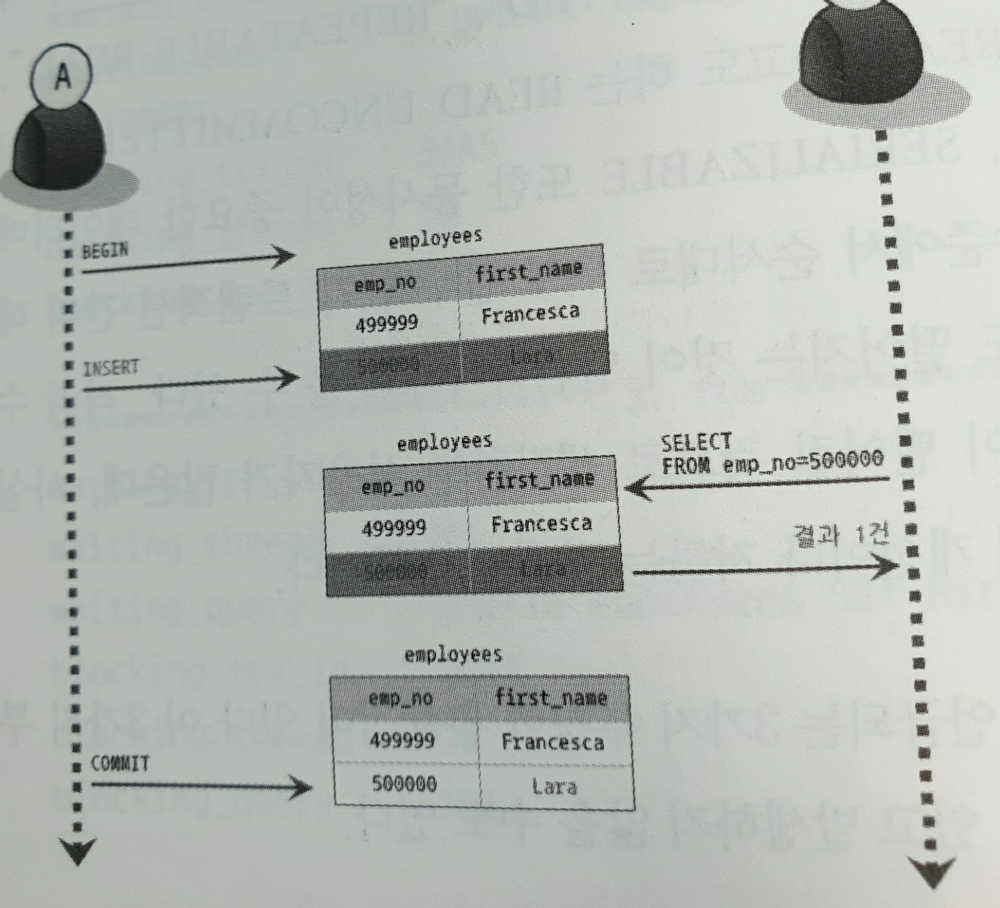
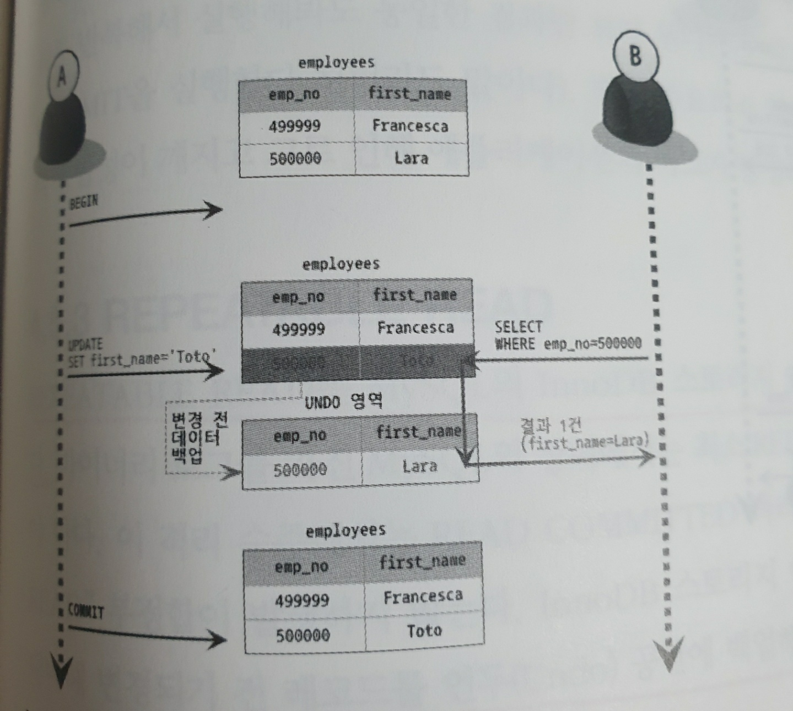
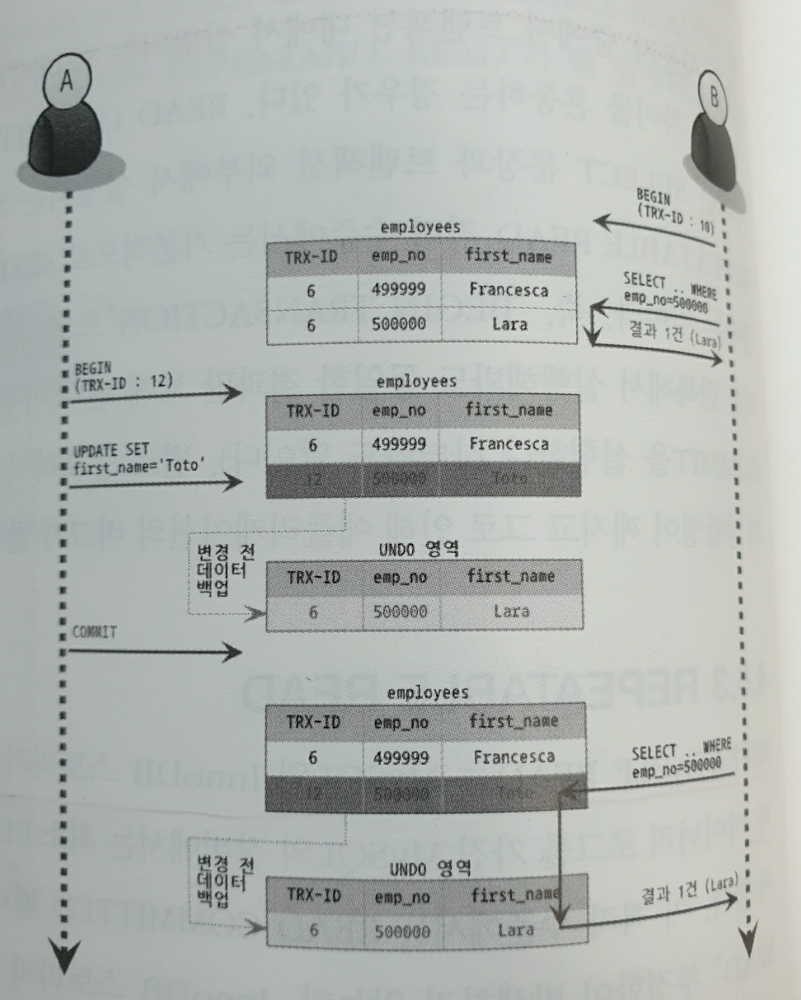

# 트랜잭션과 잠금

## 트랜잭션

- 트랜잭션은 논리적인 연산의 최소단위로 여러개의 쿼리를 묶어 작업 자체가 DB에 완전히 반영되거나 완전히 반영되지 않도록 보장해주는 것을 말한다.

- MySQL에서 MyISAM 엔진에서는 트랜잭션이 없고, InnoDB 엔진에만 트랜잭션이 존재한다.

- 트랜잭션의 단위는 반드시 최소단위로 유지해야 한다. 트랜잭션의 크기가 커질수록 데이터베이스 커넥션을 오랜 시간 사용하기 때문에 각 쓰레드가 커넥션을 대기하는 문제가 발생할 수 있다.

- FTP 파일전송 또는 네트워크와 통신하는 작업 등은 트랜잭션에서 제외하는 것이 좋다. 문제가 발생했을 때 DBMS 서버까지 위험해질 수 있기 때문이다.

**트랜잭션 분할 예시**

```
1) 처리시작
2) 사용자의 로그인 여부 확인
3) 사용자의 글쓰기 내용의 오류 발생 여부 확인
4) 첨부로 업로드된 파일 확인 및 저장

==> 데이터베이스 커넥션 생성(또는 커넥션 풀에서 가져오기)
==> 트랜잭션 시작
5) 사용자의 입력 내용을 DBMS에 저장.
6) 첨부 파일 정보를 DBMS에 저장
<== 트랜잭션 종료(COMMIT)

7) 저장된 내용 또는 기타 정보를 DBMS에서 조회
8) 게시물 등록에 대한 알림 메일 발송

==> 트랜잭션 시작
9) 알림 메일 발송 이력을 DBMS에 저장
<== 트랜잭션 종료(COMMIT)

<== 데이터베이스 커넥션 종료(또는 커넥션 풀에 반납)
```

## MyISAM과 MEMORY 스토리지 엔진의 잠금

- 읽기 잠금 : 테이블에 쓰기 잠금이 걸려있지 않으면 바로 읽기 잠금을 획득하고 읽기 작업을 시작할 수 있다.

- 쓰기 잠금 : 테이블에 아무런 잠금이 걸려있지 않아야만 쓰기 잠금을 획득할 수 있고, 그렇지 않다면 다른 잠금이 해제될 때까지 대기해야 한다.

### 잠금 튜닝

**테이블 락 발생 횟수 확인하기**

```sql
SHOW STATUS LIKE 'Table%';
```

- 위의 결과에서 `Table_locks_immediate`는 다른 잠금이 풀리기를 기다리지 않고 바로 잠금을 획득한 횟수이며, `Table_locks_waited`는 다른 잠금이 이미 해당 테이블을 사용하고 있어서 기다려야 했던 횟수를 누적 저장하고 있다.

- 위의 수치는 MyISAM이나 MEMORY 또는 MERGE 스토리지 엔진을 사용하는 테이블이 대상이 된다. (InnoDB는 제외임.)

**클라이언트 별 잠금 확인하기**

```sql
SHOW PROCESSLIST;
```

- Status가 `Locked`이라면 현재 잠금을 획득하기 위해 대기하는 상태라는 뜻이다. 잠금을 반환하지 않는 프로세스를 종료시키고 싶다면 `KILL QUERY Client_ID`를 사용하면 된다.

## InnoDB 스토리지 엔진의 잠금

- InnoDB 스토리지 엔진은 엔진 내부에서 레코드 기반의 잠금 방식을 탑재하고 있다.

- MySQL의 `INFORMATION_SCHEMA`라는 데이터베이스에 존재하는 `INNODB_TRX`, `INNODB_LOCKS`, `INNODB_LOCK_WAITS`라는 테이블을 조인해서 조회하면 현재 어떤 트랜잭션이 어떤 잠금을 대기하고 있고 해당 잠금을 어느 트랜잭션이 가지고 있는지 확인할 수 있으며, 장시간 잠금을 가지고 있는 클라이언트를 종료하는 것도 가능하다.

### InnoDB의 잠금 방식

- 비관적 잠금 : 하나의 레코드에 여러 트랜잭션이 동시에 접근할 수 있다는 가정하에 잠금을 거는 방식으로, 레코드에 대해 잠금을 획득하고 변경 작업을 처리하는 방식을 사용한다.

- 낙관적 잠금 : 하나의 레코드에 여러 트랜잭션이 동시에 접근할 가능성이 매우 희박하다는 가정하에 잠금을 거는 방식으로, 변경작업을 수행하고 마지막에 잠금 충돌이 있었는지 확인하여 문제가 있었다면 ROLLBACK을 하는 방식을 사용한다.

### InnoDB 잠금 종류

- 레코드 락 : 레코드 자체만을 잠그는 락을 말한다. InnoDB 스토리지 엔진은 레코드 자체가 아니라 인덱스를 잠그는 방식으로 동작한다.

- 넥스트 키 락 : 레코드 락과 갭 락을 합쳐놓은 형태의 잠금을 넥스트 키 락이라고 부른다. 넥스트 키 락은 변경하고자 하는 레코드 뿐만 아니라 레코드와 인접한 레코드 사이의 간격까지도 락을 거는 방식이다. 의외로 넥스트 키 락에 의해 데드락이 발생하는 경우가 많다.

### 인덱스와 잠금

- MySQL에서는 변경해야 할 레코드를 찾기 위해 검색한 인덱스의 레코드를 모두 잠그는 방식으로 동작한다.

**인덱스 잠금 예시**

```sql
UPDATE employees SET hire_date = NOW()
WHERE first_name='Georgi' AND last_name = 'Klassen';
```

- 이 쿼리를 수행하기 위해 `idx_first_name`의 값이 `Georgi`인 모든 레코드(인덱스)에 잠금을 수행한다. 굉장히 이상한(?) 방식인데, 이와 같은 방식을 사용하는 이유는 넥스트 키 락 때문이다.

- 테이블에 인덱스가 하나도 없을 경우, 모든 레코드에 대해 잠금을 걸 수도 있다.

### 트랜잭션 격리 수준과 잠금

- 넥스트 키 락을 사용하는 이유는 복제를 위한 바이너리 로그 때문이다. 레코드 기반의 바이너리 로그를 사용하거나 바이너리 로그를 사용하지 않는 경우에는 InnoDB의 갭 락이나 넥스트 키 락의 사용을 대폭 줄일 수 있다.

**설정 방법**

```
방법 1.
1) 바이너리 로그를 비활성화
2) 트랜잭션 격리 수준을 READ-COMMITED로 변경

방법 2.
1) 레코드 기반의 바이너리 로그를 사용
2) innodb_locks_unsafe_for_binlog = 1
3) 트랜잭션 격리 수준을 READ-COMMITED로 변경
```

- 위와 같이 설정하면 인덱스를 이용하지 않는 나머지 조건의 일치 여부를 판단하는 2차 비교에서 실제 업데이트 대상이 아니라는 것을 알게됨과 동시에 1차 비교에서 걸었던 잠금을 해제한다.

## MYSQL의 격리 수준

- 트랜잭션의 격리 수준이란 동시에 여러 트랜잭션이 처리될 때, 특정 트랜잭션이 다른 트랜잭션에서 변경하거나 조회되는 데이터를 볼 수 있도록 허용할지 말지를 결정하는 것이다.

- `SERIALIZABLE`을 제외하면 크게 성능이 떨어지거나 개선되지는 않는다.

### READ UNCOMMITED



- 트랜잭션 A가 변경하고 아직 Commit하지 않은 데이터를 읽을 수 있다. 트랜잭션 A가 Rollback을 수행하더라도 트랜잭션 B는 변경한 데이터를 가지게 되는데, 이를 `Dirty Read` 라고 부른다.

- MySQL을 사용한다면 최소한 `READ COMMITED` 이상은 사용하자.

### READ COMMITED



- `READ COMMITED`는 오라클에서 사용하는 기본 격리 수준이며, 온라인 서비스에서 가장 많이 선택되는 격리 수준이다.

- 트랜잭션 B는 트랜잭션 A가 변경한 내용을 조회하는 것이 아니라, UNDO 영역에서 조회하게 된다. 이를 통해서 `Dirty Read`를 방지할 수 있다.

- 트랜잭션 B가 똑같은 쿼리를 2번 호출했을 때, `NON REPEATABLE READ`가 발생한다.

### REPEATABLE READ



- `REPEATABLE READ`는 MySQL에서 사용하는 기본 격리 수준이다.

- MySQL은 트랜잭션이 ROLLBACK될 가능성에 대비해 변경되기 전에 레코드를 언두(UNDO) 공간에 백업해두고 실제 레코드 값을 변경한다. 이러한 변경방식을 MVCC라고 한다. 즉, READ COMMITED도 MVCC라고 볼 수 있다.

- 모든 InnoDB의 트랜잭션은 고유한 트랜잭션 번호를 가지며, 언두 영역에 백업된 모든 레코드에는 변경을 발생시킨 트랜잭션의 번호가 포함되어 있다.

- 언두 영역의 백업된 데이터는 InnoDB 스토리지 엔진이 불필요하다고 판단하는 시점에 주기적으로 삭제한다.

- 하나의 레코드에 대해 백업이 하나 이상 존재할 수 있다.

- MVCC를 사용하면 `Phantom Read`가 발생하지 않는다.

### SERIALIZABLE

- InnoDB에서 `select` 작업은 아무런 레코드 잠금도 설정하지 않고 실행된다. 이를 `Non-locking consistence read`라고도 부른다.

- 트랜잭션의 격리 수준이 `SERIALIZABLE`이라면 읽기 작업도 읽기 잠금을 획득해야 하며, 동시에 다른 트랜잭션은 그러한 레코드를 변경하지 못하게 해야 한다. 일반적인 DBMS에서 일어나는 `Phantom Read`라는 문제가 발생하지 않는다. (차라리 REPEABLE READ를 쓰자.)

