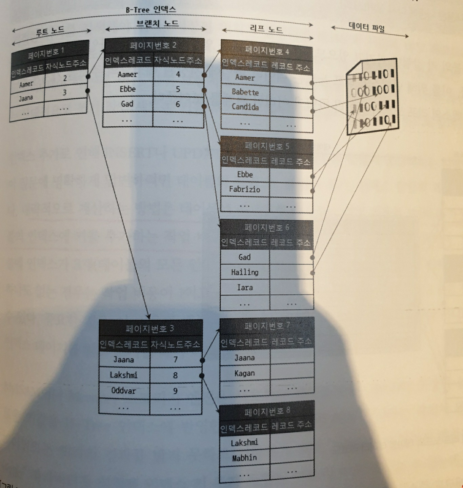

# 인덱스

## 디스크 읽기 방식

- 순차I/O : 디스크에 있는 데이터를 순차적으로 읽는 방식이다. 디스크 헤더가 움직이지 않기 때문에 데이터를 읽는 속도가 빠르다.

- 랜덤I/O : 디스크에 산발적으로 흩어져있는 데이터를 읽는 방식이다. 디스크 헤더가 이동하는 시간이 추가적으로 소요된다.

- 일반적으로 쿼리를 튜닝하는 것은 랜덤I/O 자체를 줄여주는 것이라고 볼 수 있다.

- 인덱스 레인지 스캔은 주로 랜덤I/O를 사용하고, 풀 테이블 스캔은 순차I/O를 사용한다.

## 인덱스란?

- 인덱스 : 칼럼의 값과 해당 레코드가 저장된 주소를 키와 값의 쌍으로 만들어 레코드를 빠르게 찾을 수 있도록 도와주는 것이다.

- 한 테이블에 인덱스를 너무 많이 생성하면 데이터 저장 성능이 떨어지고 인덱스의 크기가 비대해져 오히려 역효과를 불러올 수 있다.

**인덱스 역할 분류**

- 프라이머리 인덱스 : 기본키에 생성되는 인덱스로 MySQL에서는 클러스터링 인덱스로 생성한다.

- 보조 인덱스 : 기본키 외의 모든 인덱스를 의미한다.

**인덱스 알고리즘 분류**

- B-Tree : 칼럼의 값을 변경하지 않고, 원래의 값을 이용해 인덱싱하는 알고리즘이다. `Balanced Tree`이므로 검색에 대한 시간복잡도는 O(logN)이 된다.

- hash 인덱스 : 칼럼의 값을 해시 값으로 계산해서 인덱싱하는 알고리즘으로 시간복잡도 O(1)로 검색이 가능하다. 하지만, 범위검색이나 전방일치 검색같은 기능을 사용할 수 없다.

**인덱스 데이터 중복여부**

- 인덱스 데이터가 중복이 가능하다면 동등조건으로 검색했을 때에도 모든 데이터를 탐색하게 된다. 반면, 인덱스의 데이터가 유니크하다면 옵티마이저는 1건의 데이터를 찾으면 된다는 사실을 알고, 데이터를 찾으면 더 이상 탐색하지 않는다.

### B-Tree 인덱스



- B-Tree 인덱스는 특정 컬럼을 기준으로 오름차순 정렬되어있지만, 실제 레코드는 기본키를 기준으로 저장되어있다. `(MySQL의 클러스터링 인덱스 특징)`

- InnoDB 테이블에서는 프라이머리 키에 의해 클러스터링 되기 때문에 프라이머리 키 값 자체가 주소 역할을 한다.

### B-Tree 인덱스 CRUD

- 테이블에 데이터를 추가하는 비용을 1이라고 한다면, 해당 테이블의 인덱스에 키를 추가하는 비용은 1~1.5 정도로 예측하는 것이 일반적이다. 

- 테이블에 인덱스가 3개 있다면, 비용은 1 + 1.5*3 = 5.5 정도로 볼 수 있다.

**인덱스 키 추가**

- 인덱스에 키를 추가하는 비용이 큰 이유는 인덱스가 자체적으로 정렬되어있기 때문에 데이터를 삽입하기 위해 삽입될 위치를 찾고 삽입하고 `ReBalancing(트리 높이 조절)` 작업을 해야 하기 때문이다.

- InnoDB의 스토리지 엔진은 상황에 따라 적절하게 인덱스 키 추가 작업을 지연시켜 나중에 처리할지, 아니면 바로 처리할지 결정한다. `(Change Buffering 기법)`

**인덱스 키 삭제**

- 인덱스 삭제는 B-Tree 인덱스의 리프 노드를 찾아서 삭제 마크만 표시한다. 이 또한 디스크 I/O가 필요한 작업이므로 MySQL 5.5 이상에서는 지연처리의 대상으로 볼 수 있다.

**인덱스 키 변경**

- 인덱스를 삭제하고 인덱스를 삽입하는 방식이다.

**인덱스 키 탐색**

- 인덱스는 INSERT, DELETE, UPDATE의 코스트가 높지만 검색을 위해서 사용한다. 

- B-Tree 인덱스는 전방일치(또는 전체일치) 검색에만 사용할 수 있다.

- MySQL의 InnoDB에서는 검색을 수행한 인덱스를 잠근 후 테이블의 레코드를 잠그는 방식으로 구현되어있다. 따라서 UPDATE, DELETE를 실행할 때 인덱스가 없다면 불필요하게 많은 레코드를 잠그게 된다.

### B-Tree 인덱스에 영향을 미치는 요소

**인덱스 키 값의 크기**

- InnoDB 스토리지 엔진은 디스크에 데이터를 저장하는 기본 단위를 페이지(Page) 또는 블록(Block)이라고 하며, 디스크의 모든 읽기 및 쓰기 작업의 최소 단위가 된다. 

- InnoDB의 모든 페이지 크기는 default로 16KB로 고정되어있다. 인덱스의 키 크기가 크다면, 한 페이지에 인덱스를 다 넣지 못하므로 디스크 입출력이 추가적으로 발생할 수 있다. `(다단계 인덱스의 구조)`

- 인덱스를 캐시해 두는 InnoDB의 버퍼 풀이나 MyISAM의 키 캐시 영역은 크기가 제한적이기 때문에 하나의 레코드를 위한 인덱스의 크기가 커지면 커질수록 메모리에 캐시해둘 수 있는 레코드 수는 줄어들게 된다.

**선택도(기수성)**

- 선택도(기수성) : 모든 인덱스 키 값 가운데 유니크한 값의 수를 의미한다.

- 선택도가 높은 컬럼을 인덱스로 만드는 것이 좋다. 선택도가 낮은 경우 불필요하게 데이터를 읽어야할 수 있기 때문이다.

**읽어야 하는 레코드의 건수**

- 테이블에 레코드가 100만건 저장되어있는데 읽어야하는 레코드가 50만건이라면 인덱스를 통해 읽는 것보다 전체를 읽는 것이 빠를 수 있다.

- 전체 레코드의 20%~25%를 넘어서면 인덱스를 이용하지 않고 직접 테이블을 모두 읽어서 필요한 레코드만 가려내는 방식으로 처리하는 것이 좋다. 옵티마이저가 스스로 판단하여 동작한다.

### B-Tree 인덱스를 통한 읽기

**인덱스 레인지 스캔**

- 범위 검색이 주어졌을 때 동작하는 방식으로, 시작하는 위치를 찾은 후 리프 노드의 레코드를 순서대로 읽는다.

- 인덱스의 칼럼 순서대로 데이터를 읽기 때문에 일반적으로 랜덤I/O가 발생한다. 즉, 검색 대상이 3건일 경우, 3번의 I/O가 발생할 수 있다.

**인덱스 풀 스캔**

- 인덱스를 처음부터 끝까지 읽는 방식을 인덱스 풀 스캔이라고 한다.

- 일반적으로 인덱스를 풀 스캔할거라면 테이블을 풀 스캔하는 것이 순차I/O이기 때문에 속도가 더 빠르다. 하지만, 실제 레코드가 아니라 인덱스만 보고 쿼리를 수행할 수 있는 경우에는 인덱스 풀 스캔이 더 낫다. 예를 들어, `Exist`, `Count`와 같은 쿼리는 실제 레코드를 찾지 않고 인덱스만 보고도 판단할 수 있기 때문이다.

**루스 인덱스 스캔**

- 인덱스를 느슨하게 탐색한다는 의미로 붙여진 이름이다. 중간마다 필요치 않은 인덱스 키 값은 무시하고 다음으로 넘어가는 형태로 처리한다. 일반적으로 `GROUP BY` 또는 집합 함수 가운데 `MAX()` 또는 `MIN()` 함수에 대해 최적화 하는 경우가 많다.


```sql
SELECT dept_no, MIN(emp_no)
FROM dept_emp
WHERE dept_no BETWEEN 'd002' AND 'd004'
GROUP BY dept_no;
```

- `d002`에서 `emp_no`이 제일 작은 값을 찾게 되면(인덱스는 오름차순으로 정렬되어있음) 더 이상 `d002`를 탐색할 필요가 없다.


### B-Tree 인덱스의 정렬 및 스캔 방향

- MySQL은 인덱스가 무조건 오름차순으로 정렬되어있다. 인덱스를 내림차순으로 정렬하고 싶다면 음수로 저장하는 등 편법을 사용해야 한다.

- MySQL 인덱스는 역순으로 정렬되게 할 수는 없지만 인덱스를 읽는 방향은 조절이 가능하다. 옵티마이저가 인덱스 읽기 방향을 적절히 판단한다.

```sql
SELECT * FROM employees WHERE first_name >= 'Anneke'
ORDER BY first_name ASC LIMIT 4;    //앞에서부터 탐색

SELECT * FROM employees ORDER BY first_name
DESC LIMIT 5;           //뒤에서부터 탐색
```

### B-Tree 인덱스의 가용성과 효율성

>INDEX ix_test (col_1, col_2, ... col_n)

- `col_i`를 사용하지 않거나, `IN`, `<`, `>` `LIKE`와 같이 범위 검색을 사용할 경우 `col_i+1`에서는 인덱스 사용이 불가능하다.

